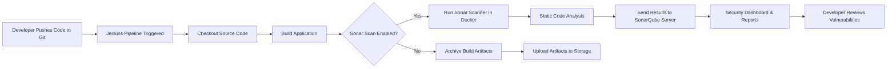

## DevSecOps SAST Pipeline Flow

```mermaid
flowchart LR

A[Developer Pushes Code to Git] --> B[Jenkins Pipeline Triggered]

B --> C[Checkout Source Code]

C --> D[Build Application]

D --> E{Sonar Scan Enabled?}

E -->|Yes| F[Run Sonar Scanner in Docker]

F --> G[Static Code Analysis]

G --> H[Send Results to SonarQube Server]

H --> I[Security Dashboard & Reports]

E -->|No| J[Archive Build Artifacts]

J --> K[Upload Artifacts to Storage]

I --> L[Developer Reviews Vulnerabilities]

```

Note: This Job runs on-demand only 
